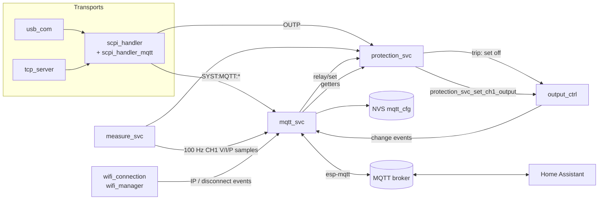
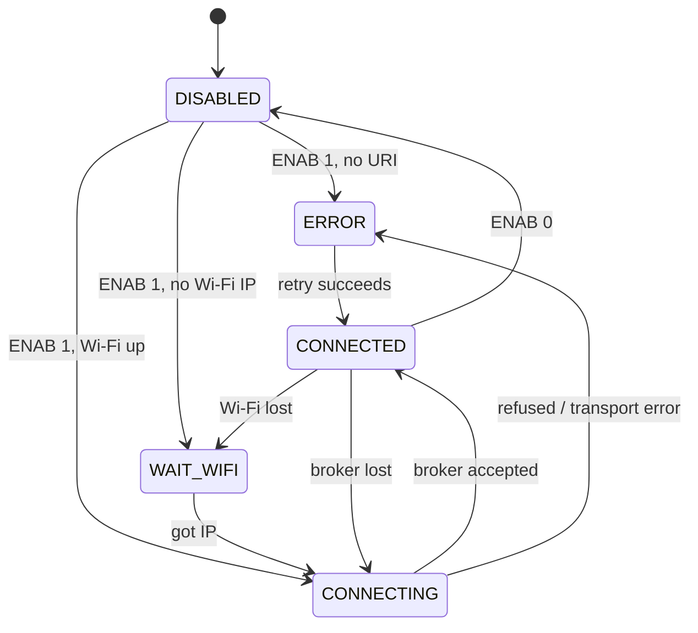
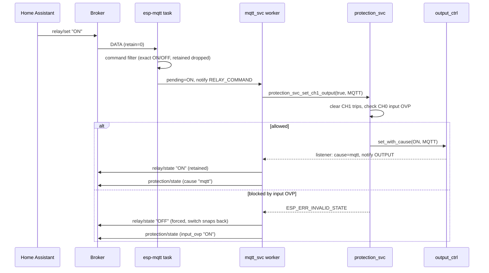

# MQTT / Home Assistant: Architecture

Status: implemented on `feature/ha-mqtt-support`; device build and broker
connection verified on hardware (2026-10-04).
Design: [mqtt-home-assistant.md](mqtt-home-assistant.md).
User guide: [home-assistant.md](home-assistant.md).

## Overview

The `mqtt_svc` component adds an MQTT client so the PSU appears in Home
Assistant through device-based discovery. It reads data from the existing
services and controls the output only through the same function SCPI uses. No
existing service depends on `mqtt_svc`; it can be disabled (the default) or
fail to start without affecting the PSU.



## Changes to existing code

| Area | Change | Reason |
|---|---|---|
| `protection_svc` | New `protection_svc_set_ch1_output(enabled, cause)`: on ON clears CH1 trips, checks CH0 input OVP, then sets the output. | One implementation shared by SCPI and MQTT. Lives here because `output_ctrl` cannot depend on `protection_svc` (that would be a dependency cycle). |
| `scpi_handler_output.c` | `OUTP` calls the shared function. Responses are unchanged. | Covered by `[output]` regression tests (commit `411f195`). |
| `output_ctrl` | New `OUTPUT_CTRL_CHANGE_CAUSE_MQTT`. `timer_svc` maps it to a manual override, like SCPI. | Reported as the `mqtt` cause in HA (commit `0a7ca47`). |
| `scpi_handler.c` | The RX log line masks the argument of any `*:PASS` set command. | The password is never echoed; this also fixes `WIFI:PASS`. |
| `main.c` | `mqtt_svc_init()` runs after `wifi_connection_init()`, using `ESP_ERROR_CHECK_WITHOUT_ABORT`. | Needs the default event loop. MQTT is optional, so a failure must not stop boot. |

`trigger_svc` still clears trips without the input-OVP check. It was out of
scope for this change.

## `mqtt_svc` modules

The component is split into modules with no MQTT calls in them, which are
tested by Unity on the device and also run on a host, plus one glue file that
holds all the ESP-IDF and esp-mqtt code.

| File | Role | Testable on its own |
|---|---|---|
| `include/mqtt_svc.h` | Public API: init, config setters/getters, status. | n/a |
| `mqtt_svc_config.c` | Defaults, validation (URI, credentials, interval, prefix), NVS load/store. | Validation: yes |
| `mqtt_svc_window.c` | Telemetry window: sum, min, max, and count per V/I/P; rounded means. | Yes |
| `mqtt_svc_format.c` | `u4` to `whole.ffff` text, without floats. | Yes |
| `mqtt_svc_payload.c` | cJSON builders for telemetry, protection state and discovery; cause names; snapshot comparison. Numbers are inserted as raw `u4` text. | Yes |
| `mqtt_svc_command.c` | `relay/set` filter (exact `ON`/`OFF`, retained messages dropped) and HA `online` detection. | Yes |
| `mqtt_svc_topics.c` | `<id>` from the STA MAC, client ID, and all topic strings. | Yes |
| `mqtt_svc.c` | Worker task, connection lifecycle, esp-mqtt event handling, listeners, public API. | No (hardware acceptance) |

External dependencies come from the component registry
(`components/mqtt_svc/idf_component.yml`): `espressif/mqtt` and
`espressif/cjson`. TLS uses `esp_crt_bundle_attach` from ESP-IDF's Mbed TLS.

## Concurrency model

Everything that publishes or changes the output runs in a single worker task
(`mqtt_svc`, priority 4, 6 KB stack). Other contexts only record data and wake
the worker with a FreeRTOS task notification bit. They never block, publish, or
call other services.

| Context | Runs | Does |
|---|---|---|
| Measurement sampler task | `mqtt_svc_sample_listener` | Adds the CH1 sample to the window under a spinlock. |
| Any caller of `output_ctrl_set_with_cause` | `mqtt_svc_output_listener` | Stores the latest cause and notifies `OUTPUT`. |
| esp-mqtt task | `mqtt_svc_mqtt_event_handler` | Notifies `CONNECTED` / `DISCONNECTED`, stores the latest relay command and notifies `RELAY_COMMAND`, notifies `HA_ONLINE`, records the last error. |
| Default event loop | `mqtt_svc_network_event_handler` | Updates the Wi-Fi flag and notifies `NETWORK`. |
| SCPI task | config setters | Validate, write NVS, update RAM config under the mutex, notify `RECONFIGURE` (or `WAKE` for the interval). |

Why the listeners only flag work: `protection_svc` calls
`output_ctrl_set_with_cause()` while holding its own mutex, so the output
listener runs inside that lock. Calling the protection getters from there would
deadlock. During a trip the call can also repeat at sample rate, so the
listener only overwrites one pending value and sets a bit. Repeated events
collapse into a single publish.

Shared state:

- **Mutex `s_mqtt.lock`:** config, topics, `last_error`. Taken by setters,
  `get_status`, and the worker.
- **Spinlock `pending_lock`:** the window, the pending cause, and the pending
  relay command. Held only for small copies.
- **Worker only:** the esp-mqtt client handle and the last published relay and
  protection snapshots (used to skip unchanged publishes).

## Lifecycle

The worker brings the client in line with what the config says should be
running:

```text
desired = enabled && uri != "" && wifi_connected
RECONFIGURE -> stop client (if running), start again if desired
NETWORK     -> stop if no longer desired, start if desired and not running
```

- **Stop:** if connected, publish `availability = offline` (a clean disconnect
  suppresses the last will), then call `esp_mqtt_client_stop` and `destroy`.
- **Start:** rebuild topics (the prefix may have changed), create the client
  with clean session, LWT `offline` (retained, QoS 1), keepalive 30 s,
  reconnect every 5 s, receive buffer 1 KB, send buffer 6 KB (the discovery
  message is about 3.7 KB).
- **esp-mqtt** handles reconnects itself while the client is running.

`SYST:MQTT:STAT?` reports a state computed from the config and runtime flags:



`last_error` holds a short text such as `auth failed`, `client id rejected`,
`server unavailable`, `transport: <ESP_ERR_...>`, or `socket errno N`. It is
cleared when a connection succeeds or the client restarts.

## Data flows

### On connect (and when HA publishes `online`)

1. Subscribe to `relay/set` and `<prefix>/status` (QoS 0). Not repeated for
   HA `online`.
2. Publish discovery to `<prefix>/device/psu_ext_<id>/config` (retained, QoS 1).
3. Publish `availability = online` (retained, QoS 1).
4. Publish `relay/state` and `protection/state` (retained, QoS 1, forced).
5. Reset the telemetry window (on connect only).

### Telemetry tick (every `SYST:MQTT:INT` ms while connected)

1. Copy and reset the window under the spinlock.
2. If it has voltage and current samples, publish `measurements` (QoS 0, not
   retained): V/I mean, V min/max, I max, mean of per-sample power, and the
   output state.
3. Read the protection getters and publish `protection/state` if anything
   changed. This tick check is needed because `protection_svc` has no change
   events, and a CH0 OVP that blocks an enable does not change the output.

### Relay command from Home Assistant



The HA switch is not optimistic: it shows only the state the device reports.

### Protection trip

`protection_svc` sees a sample over its limit and switches the output off with
cause OVP or OCP. `output_ctrl` notifies the listener, which notifies the
worker. The worker publishes `relay/state = OFF` once (unchanged repeats are
skipped) and `protection/state` with the latched flag and the `ovp`/`ocp` cause.

## Configuration and identity

| Key (`mqtt_cfg`) | Type | Default | Validation |
|---|---|---|---|
| `uri` | str | `""` | `mqtt://` or `mqtts://` plus a host; no whitespace, `"` or `@`; max 96 |
| `user` | str | `""` | printable, max 64 |
| `pass` | str | `""` | printable, max 64; no getter |
| `enabled` | u32 | `0` | 0/1 |
| `interval_ms` | u32 | `1000` | 200..3600000 |
| `prefix` | str | `homeassistant` | `[A-Za-z0-9_-]` levels joined by single `/`; max 32 |

Values that fail validation when loaded fall back to their defaults. The
96-character URI limit fits within the 128-byte SCPI command buffer.

Identity: `<id>` is the last 3 bytes of `ESP_MAC_WIFI_STA` (read from eFuse, so
it is available before Wi-Fi starts), and the client ID is `psu_ext_<id>`.
`sw_version` comes from `esp_app_get_description()`.

## Testing

| Level | Where | Covers |
|---|---|---|
| Unity on target, `[output]` | `scpi_handler/test/test_output_scpi.c` | `OUTP` before/after the refactor: malformed input, CH0 rejected, ON/OFF with cause, CH0 OVP block, OCP latch cleared. Drives the real relay. |
| Unity on target, `[mqtt]` | `mqtt_svc/test/test_mqtt_svc_core.c` | Formatter, window (burst example), payload format, cause names, command filter, config validation, topics, discovery contents. Also runs on a host with stubs. |
| Unity on target, `[mqtt][scpi]` | `scpi_handler/test/test_mqtt_scpi.c` | `SYST:MQTT:*` validation and persistence, password never echoed, `STAT?` format and `DISABLED`/`WAIT_WIFI` states. |
| Manual | Mosquitto + HA 2024.11+ | Lifecycle, LWT, rediscovery, relay round trip, trips, `mqtts://`. See the design doc's acceptance list. |

## Known limitations and risks

- **Registry dependencies:** IDF 6.0 no longer ships `mqtt`/`json`; they come
  from `espressif/mqtt` 1.0.0 and `espressif/cjson` 1.7.19~2
  (`dependencies.lock`).
- **Init failure** is reported by `SYST:MQTT:STAT?` as
  `ERROR,"","init failed: <ESP_ERR_...>"`.
- **Min/max resolution:** samples arrive at about 100 per second, so events
  shorter than about 10 ms can be missed.
- **Prefix changes** leave the retained discovery message under the old prefix
  in place.
- **TLS:** public CAs only; uploading a custom CA is planned for v2.
- **Security:** on a LAN broker, the relay is protected only by broker
  credentials and ACLs.
- **No dead-man timeout:** the output keeps its state when the connection is
  lost. On-device OVP/OCP remain the safety net.
- **Stale event after restart:** a `CONNECTED` notification from a client that
  was just replaced could trigger one early subscribe attempt on the new
  client. It is harmless: the subscribe fails and is redone on the real
  connect.
